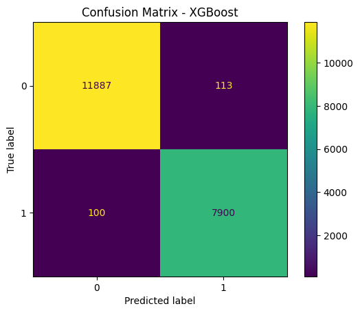
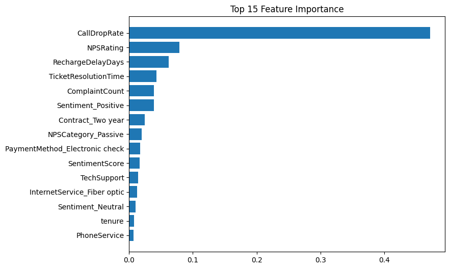
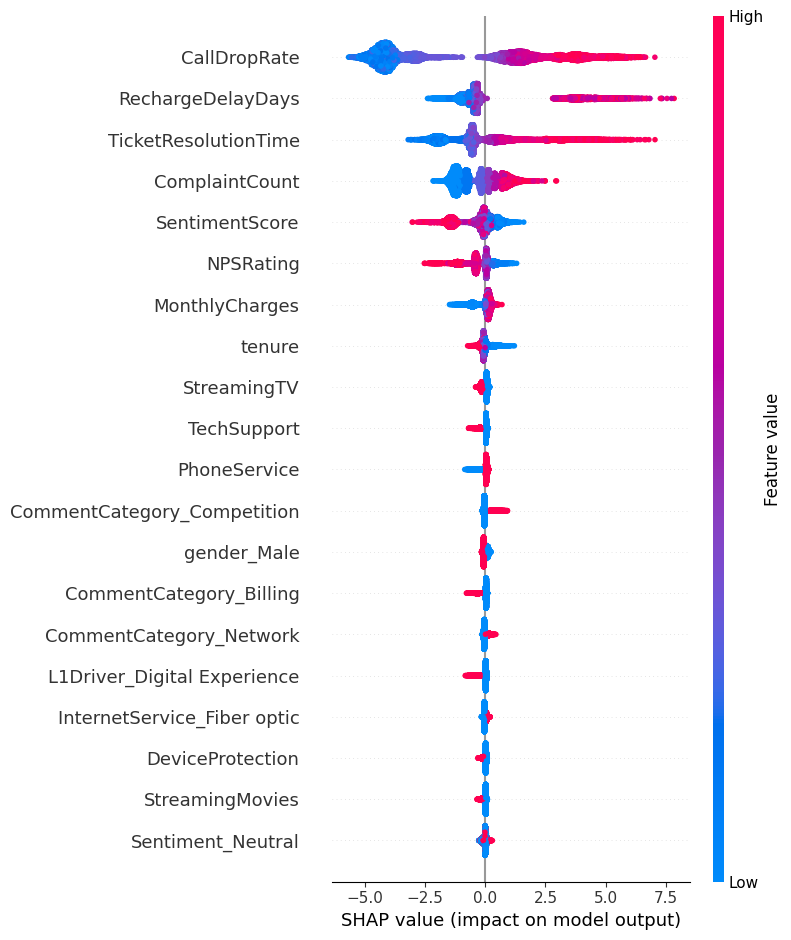
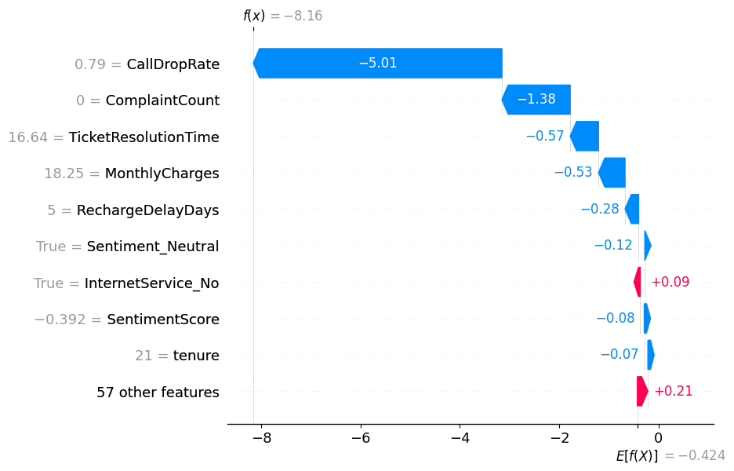

# 📊 Customer Churn Prediction & Analysis

## Dataset

The dataset contains telecom customer information such as:

- Gender
- Senior Citizen
- Partner
- Dependents
- Tenure
- Internet Service
- Contract Type
- Payment Method
- Monthly Charges
- Total Charges

## Models Used

1. Logistic Regression
2. XGBoost

## Visualizations

### Confusion Matrix

### Feature Importance

### SHAP Summary Plot

### SHAP Local Explanation

## Project Workflow

1. Data Collection
2. Data Cleaning & Preprocessing
3. Exploratory Data Analysis (EDA)
4. Feature Engineering
5. Model Training
6. Model Evaluation
7. SHAP Explainability
8. Churn Prediction Dashboard

## Conclusion

This project predicts customer churn using machine learning techniques and provides explainable insights through SHAP analysis. The results can help telecom companies identify high-risk customers and improve retention strategies.
